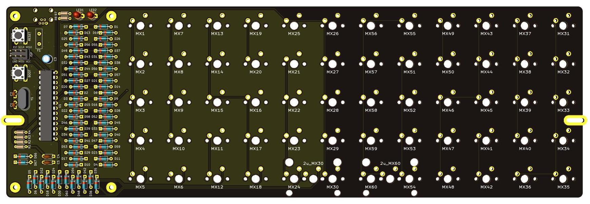
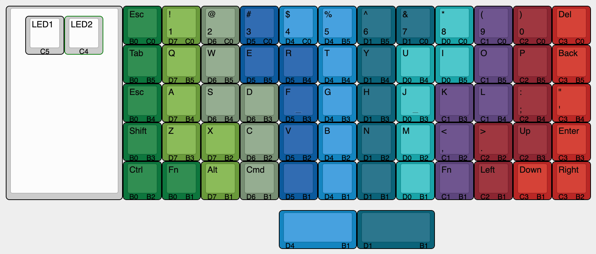

# Crosshatch - Through-hole ortholinear 60% keyboard PCB

Crosshatch is a 12 column ortholinear keyboard PCB using through-hole components only.

The goal of this project is to build an all through-hole component ortholinear PCB that fits in a standard 60% tray mount case.

Inspired by the [Plaid keyboard](https://github.com/hsgw/plaid).

* Designed to be easy to build with minimal soldering experience.
* All through-hole components, no SMD soldering required.
* Get that visible component aesthetic in a standard 60% tray-mount case.
* Plateless.

# Bill of Materials (BOM)

|Ref|num||
| :- |  :- |  :- | 
|C1,C2|2|multilayer ceramic capacitor 22pF or 20pF|
|C3|1|electrolytic capacitor 10uF|
|C4,C5|2|multilayer ceramic capacitor 0.1uF|
|D1-60|60|diode 1n4148|
|D66,D67|2|zener diode 3.6V|
|F1|1|polyfuse 100mA|
|J1|1|USB miniB connector Omron XM7D-0512 or equivalent|
|J2|1|2x3 pin header|
|LED1|1|3mm LED red|
|MX1-60|60|MX PCB mount (5 pin) keyboard switch|
|R1,R7|3|resistor 1.5kΩ|
|R2,R3|2|resistor 75Ω|
|R4|1|resistor 10kΩ|
|SW50,SW51|2|tactile switch|
|U1|1|ATMEGA328P|
|Y1|1|crystal 16MHz|
|PCB|1||
|stabilizer|0-2|switch stabilizer for optional 2u keys|
|cover|1|acrylic component cover|
|screw|8|M2 8mm|
|standoff|4|M2 10mm|

# Ordering PCBs

PCBs can be manufactuered by a variety of online PCB fabricators. You can use [PCBShopper](https://pcbshopper.com/) to search for the best price.

The zip file in the gerber directory contains the gerber files your fabricator will need to make the PCB [lumberjack.zip](https://github.com/peej/crosshatch-keyboard/blob/master/gerber/crosshatch.zip) PCB.

When uploading the gerber zip files, use the default PCB settings.

# Construction

TBD

# Bootloader

TBD

# Firmware

TBD

# Component cover

95x38mm 2mm thick acrylic

TBD